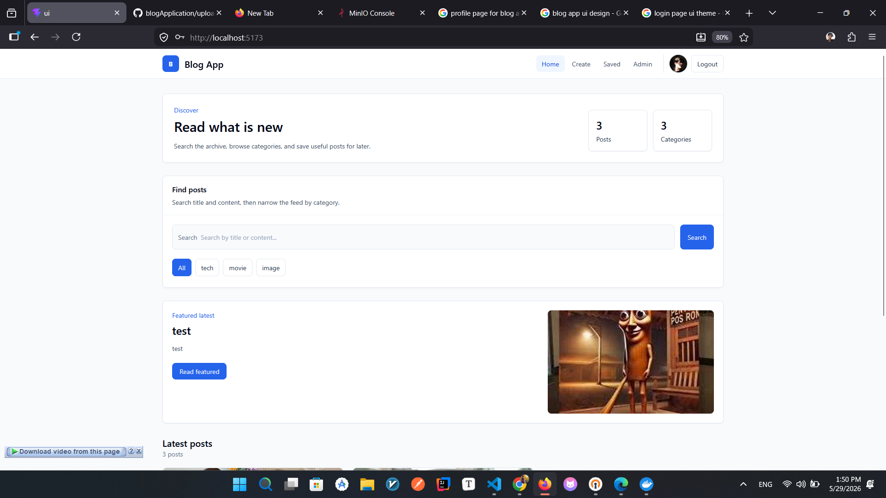
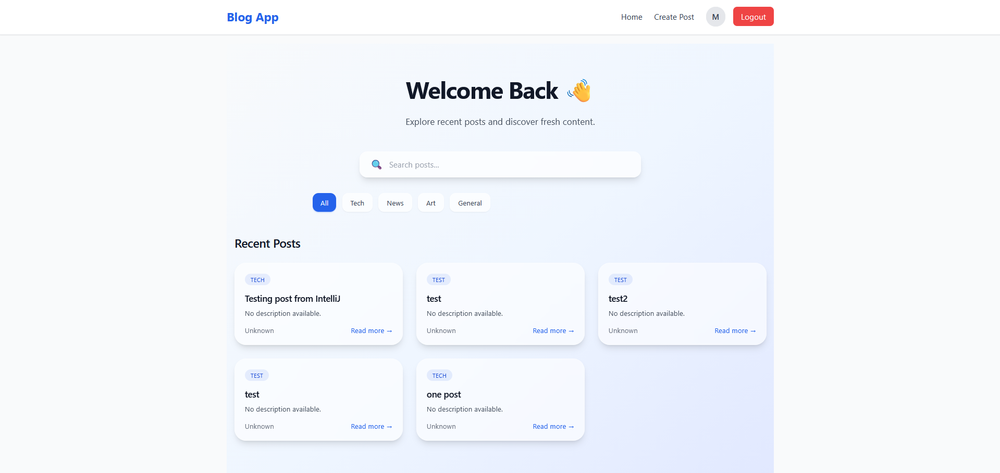
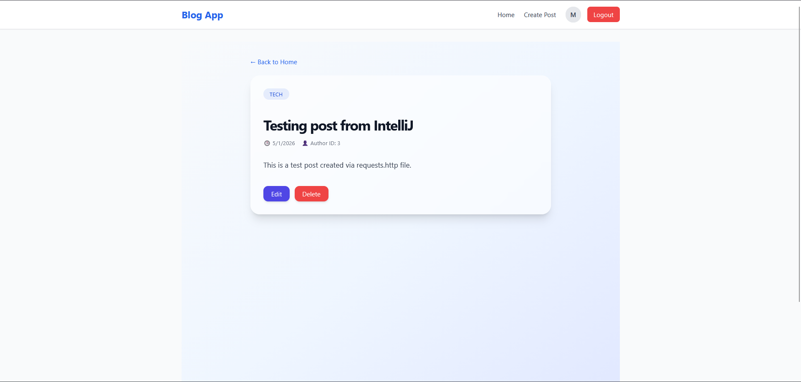
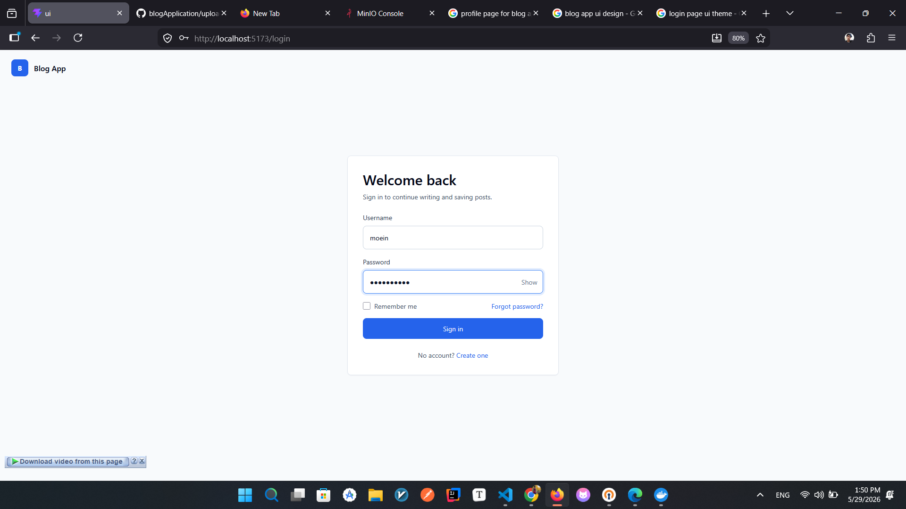

# Blog Application

A full-stack blog platform built with Spring Boot and React featuring JWT authentication, role-based authorization, secure REST APIs, and a responsive client application.


## Table of Contents

- [Tech Stack](#tech-stack)
- [Screenshots](#screenshots)
- [Features](#features)
- [Architecture](#architecture)
- [Installation & Setup](#installation--setup)
- [Lessons Learned](#lessons-learned)
- [Future Improvements](#future-improvements)


## Tech Stack

### Backend
- Java
- Spring Boot
- Spring Security
- JWT Authentication
- Spring Data JPA / Hibernate
- PostgreSQL
- MapStruct
- Lombok
- Maven

### Frontend
- React
- Vite
- Tailwind CSS
- React Router
- Context API
- Fetch API


# Screenshots






## Features

### Authentication & Authorization
- JWT-based authentication with stateless sessions
- Role-based authorization (USER, ADMIN, SUPERADMIN)
- Secure password hashing with BCrypt
- Custom JWT filter integrated into Spring Security filter chain
- Protected API endpoints aligned with user roles
- Protected frontend routes using React Router + AuthContext
- Admin-only routes and admin dashboard protection

### Backend Architecture
- Feature-based modular structure (auth, user, post, comment, etc.)
- Layered architecture: Entity → DTO → Mapper → Service → Controller
- MapStruct for fast DTO ↔ Entity mapping
- Centralized validation layer
- Reusable BaseEntity for auditing and consistency
- Repository layer built on Spring Data JPA & Hibernate
- Clear separation of business logic and API transport models

### Blog Functionality
- Create, update, delete, and fetch posts
- View post details with comments
- Comment system with create/edit/delete
- Comment likes support
- Ownership checks for modifying own posts/comments
- Public access for browsing posts
- Authenticated access for write actions

### Frontend Application
- React SPA with Vite for fast development
- TailwindCSS for responsive UI design
- Context-based authentication state management
- Persistent login using localStorage
- Centralized API layer using custom `apiFetch` wrapper
- Admin pages for managing users and posts
- User profile page

### Security
- Fully stateless backend using JWT
- Custom JwtAuthFilter with token validation
- UserDetailsService integration for user loading
- Invalid token and authentication handling
- CORS configuration for frontend communication


## Architecture

The project is built with a feature‑oriented and layered architecture on the backend, and a modular component‑based architecture on the frontend.

### Backend Architecture

The backend follows a **feature‑based package structure**, where each domain (auth, user, post, comment) contains its own:
- `entity`
- `dto`
- `mapper`
- `service`
- `repository`
- `validator`
- `controller`

This keeps the codebase modular and maintainable.

**Layered design:**

Entity → DTO → Mapper → Service → Controller

Additional backend components:
- `JwtAuthFilter` for token extraction and validation  
- `JwtService` for signing & verifying JWT tokens  
- Global `SecurityConfig` for authentication, authorization, and stateless sessions  
- `PasswordConfig` for BCrypt hashing  
- CORS & Web configurations  
- BaseEntity for shared fields (timestamps, id, etc.)

Data persistence:
- Spring Data JPA repositories with Hibernate
- PostgreSQL as the primary database

---

### Frontend Architecture

The frontend is structured as a modern React SPA using Vite and Tailwind CSS.

Key folders:
- `components/` — reusable UI components  
- `pages/` — route‑level screens  
- `context/` — global state (AuthContext)  
- `services/` — API clients per feature  
- `utils/` — helpers like `apiFetch`  
- `hooks/` — custom hooks  
- `assets/` — images & static files

Routing:
- Public routes (home, login, register, post details)
- Protected routes using `RequireAuth`
- Role‑protected admin routes using `RequireAdmin`

State management:
- Context API for authentication state
- Token & user persistence via `localStorage`

API communication:
- Custom `apiFetch` wrapper that automatically attaches JWT tokens
- Per-feature API service modules for clean separation

---

### Client–Server Communication

The frontend communicates with the backend via:
- JSON REST APIs
- JWT Authorization headers (`Authorization: Bearer <token>`)

Public endpoints:
- Browse posts
- View post details & comments
- Register/Login

Authenticated endpoints:
- Create/update/delete posts
- Create/update/delete comments
- Access profile data

Admin endpoints:
- Manage users
- Manage posts

---


# Installation & Setup

### Backend Setup (Spring Boot)

Navigate to the backend directory:

```bash
cd api/
```

Configure your database in `application.properties`:

```properties
spring.datasource.url=jdbc:postgresql://localhost:5432/blogdb
spring.datasource.username=your_username
spring.datasource.password=your_password
```

Run the application:

```bash
mvn spring-boot:run
```

The backend will start at:

```
http://localhost:8080
```

---

### Frontend Setup (React)

Navigate to the frontend directory:

```bash
cd ui/
```

Install dependencies:

```bash
npm install
```

Run the development server:

```bash
npm run dev
```

The frontend will run at:

```
http://localhost:5173
```


## Lessons Learned

Through building this project, I strengthened my understanding of:

- Designing layered backend architectures with Spring Boot

- Implementing JWT authentication and role-based authorization

- Structuring scalable React applications

- Managing authentication state with Context API

- Building protected frontend and backend routes

- Organizing feature-based full-stack applications

- Continuing to improve the project through future iterations

  


## Future Improvements

- Media upload support for posts and user profiles
- Refresh token implementation for improved authentication flow
- Search and filtering functionality
- Improved Pagination and infinite scrolling 
- Email verification and password reset
- Dockerized deployment setup
- Automated testing (unit & integration tests)
- Rich text editor for blog content


